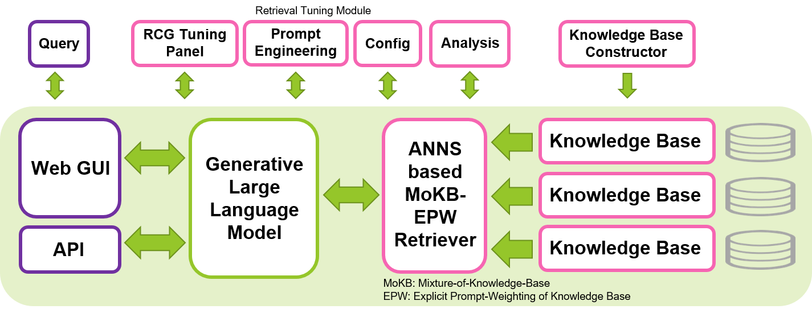
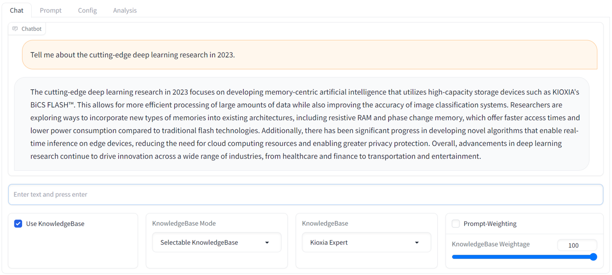

# SimplyRetrieve: A Private and Lightweight Retrieval-Centric Generative AI Tool
[](https://zenodo.org/badge/latestdoi/670095284)


📰**News**: *Aug 21, 2023* -- Users can now create and append knowledge on-the-fly through the newly added `Knowledge Tab` in the GUI. Also, progress bars added in Config & Knowledge Tabs.

## 🤔 What is SimplyRetrieve?

*SimplyRetrieve* is an open-source tool with the goal of providing a fully localized, lightweight and user-friendly GUI and API platform for *Retrieval-Centric Generation* (RCG) approach to the machine learning community.

Create chat tool with your documents and language models, highly customizable. Features are:
- 📚 GUI and API based Retrieval-Centric Generation platform
- 🔧 Retrieval Tuning Module with Prompts Engineering, Tool Configuration and Retrieval Analysis
- 🏡 Private Knowledge Base Constructor
- 🧠 Fully localized, private and lightweight access to various sizes of open-source Large Language Models (LLMs)
- 🚥 Multi-user concurrent access to UI, utilizing Gradio's queue function

A technical report about this tool is available at [arXiv](https://arxiv.org/abs/2308.03983). 📖

A short video about this tool is available at [YouTube](https://youtu.be/0V2M3B42zjs). 🎞️



## 💡 Why this tool?
We aim to contribute to the development of safe, interpretable, and responsible LLMs by sharing our open-source tool for implementing RCG approach. We hope this tool enables machine learning community to explore the use of LLMs in a more efficient way, while maintaining privacy and local implementation. Retrieval-Centric Generation, which builds upon the Retrieval-Augmented Generation (RAG) concept by emphasizing the crucial role of the LLMs in context interpretation and entrusting knowledge memorization to the retriever component, has the potential to produce more efficient and interpretable generation, and reduce the scale of LLMs required for generative tasks. This tool can be run on a single Nvidia GPU, such as the T4, V100 or A100, making it accessible to a wide range of users.

This tool is constructed based mainly on the awesome and familiar libraries of [Hugging Face](https://huggingface.co/), [Gradio](https://gradio.app/), [PyTorch](https://pytorch.org/) and [Faiss](https://faiss.ai/). The default LLM configured in this tool is the instruction-fine-tuned [Wizard-Vicuna-13B-Uncensored](https://huggingface.co/ehartford/Wizard-Vicuna-13B-Uncensored). The default embedding model for retriever is [multilingual-e5-base](https://huggingface.co/intfloat/multilingual-e5-base). We found these models work well in this system, as well as many other various sizes of open-source LLMs and retrievers available in Hugging Face. This tool can be run in other languages as well apart from English, by selecting appropriate LLMs and customizing prompt templates according to the target language.

## 🔍 What potential developments that can be explored using this tool?

- Examining the effectiveness of retrieval-centric generation in developing safer, more interpretable, and responsible AI systems
- Optimizing the efficiency of separating context interpretation and knowledge memorization within retrieval-centric generation approach
- Improving prompt engineering techniques for retrieval-centric generation
- Implementing Chat AI for fully local and edge computing
- Creating personalized AI assistants tailored to individual users

## 🔨 What are the prerequisites to run this tool?
- Git clone this repository.
- In GPU-based Linux machine, activate your favourite python venv, install the necessary packages
    - `pip install -r requirements.txt`
- Optional: If you would like to use your own data as a knowledge source, you can follow these steps. However, if you prefer to start with a simpler example, you can skip these steps and use the default simple sample knowledge source provided by the tool. Note that the sample knowledge source is intended only for demonstration purposes and should not be used for performance evaluations. To achieve accurate results, it is recommended to use your own knowledge source or the Wikipedia source for general usage.
    - Prepare knowledge source for retrieval: Put related documents(pdf etc.) into `chat/data/` directory and run the data preparation script (`cd chat/` then the following command) 
      ```
      CUDA_VISIBLE_DEVICES=0 python prepare.py --input data/ --output knowledge/ --config configs/default_release.json
      ```
    - Supported document formats are `pdf, txt, doc, docx, ppt, pptx, html, md, csv`, and can be easily expanded by editing configuration file. Follow the tips on [this issue](https://github.com/nltk/nltk/issues/1787) if NLTK related error occurred.
    - **Latest: Knowledge Base creation feature is now available through the `Knowledge Tab` of the GUI tool. Users can now add knowledge on-the-fly. Running the above prepare.py script prior to running the tool is not a necessity.** 

## 🏃 How to run this tool?
After setting up the prerequisites above, set the current path to `chat` directory (`cd chat/`), execute the command below. Then `grab a coffee!` as it will just take a few minutes to load.

```
CUDA_VISIBLE_DEVICES=0 python chat.py --config configs/default_release.json
```
Then, access the web-based GUI from your favorite browser by navigating to `http://<LOCAL_SERVER_IP>:7860`. Replace `<LOCAL_SERVER_IP>` with the IP address of your GPU server. And this is it, you are ready to go!
- For `GUI operation manual`, please refer to the [GUI readme](docs/README.md) located in the `docs/` directory.
- For `API access manual`, please refer to the [API readme](examples/README.md) and sample scripts located in the `examples/` directory.

Below is a sample chat screenshot of the GUI. It provides a familiar streaming chatbot interface with a comprehensive RCG tuning panel.



Not having a local GPU server to run this tool at this moment? No problem. [Visit this Repository](https://github.com/yy29/aws-ec2-tips-llm-chat-ai). It shows the instruction to try out this tool in AWS EC2 cloud platform. 

## 🤝 Contributing
Feel free to give us any feedback and comment. We very welcome any discussion and contribution about this tool, including new features, improvements and better documentations. Feel free to open an issue or discussion. We don't have any template for issue or discussion yet so anything will do for now.

## 🛣️ Roadmap
Future Developments
- To support vLLM PagedAttention high-throughput inference
- To add Retrieval-Centric Memory (Chat History) component.
- To create a comprehensive documentation.

## ⚠️ Limitation
It is important to note that this tool does not provide a foolproof solution for ensuring a completely safe and responsible response from generative AI models, even within a retrieval-centric approach. The development of safer, interpretable, and responsible AI systems remains an active area of research and ongoing effort.

Generated texts from this tool may exhibit variations, even when only slightly modifying prompts or queries, due to the next token prediction behavior of current-generation LLMs. This means users may need to carefully fine-tune both the prompts and queries to obtain optimal responses.

## 📝 Citation
If you find our work useful, please cite us as follow:
```
@article{ng2023simplyretrieve,
    title={SimplyRetrieve: A Private and Lightweight Retrieval-Centric Generative AI Tool}, 
    author={Youyang Ng and Daisuke Miyashita and Yasuto Hoshi and Yasuhiro Morioka and Osamu Torii and Tomoya Kodama and Jun Deguchi},
    year={2023},
    eprint={2308.03983},
    archivePrefix={arXiv},
    primaryClass={cs.CL},
    journal={arXiv preprint arXiv:2308.03983}
}
```
🏛️ Affiliation: Institute of Memory Technology R&D, Kioxia Corporation, Japan
